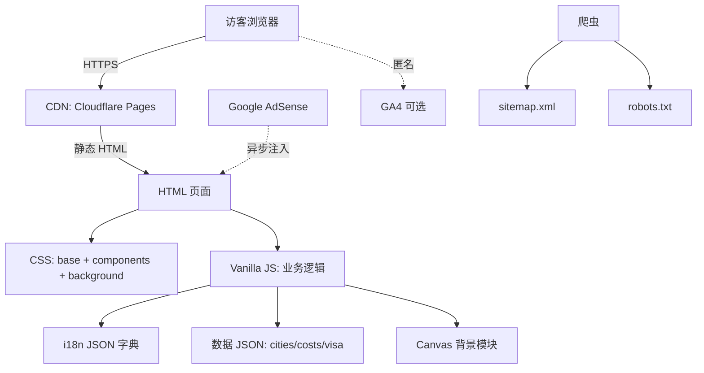

# 中国免签旅游指南 - 技术架构文档

## 1. 架构总览



**关键原则**：
- 零后端、零数据库、零构建步骤
- 一切可在浏览器打开 `index.html` 跑起来
- 数据更新通过编辑 JSON + `git push` 完成

## 2. 技术栈

| 类别 | 选型 | 理由 |
|------|------|------|
| HTML | HTML5 语义化标签 | SEO、AdSense、可访问性 |
| CSS | 原生 CSS3 + CSS Variables | 无构建依赖，足够表达设计 |
| JS | Vanilla JS（ES2020，无模块/无打包） | 静态、零依赖、易部署 |
| 字体 | Google Fonts（CDN） | Playfair Display + Noto Serif SC + Manrope |
| 图标 | Lucide Icons（本地 SVG） | 无运行时依赖 |
| 数据 | 本地 JSON | 易于编辑、版本控制 |
| 部署 | Cloudflare Pages（推荐）/ Vercel / Netlify | 免费、自动 HTTPS、全球 CDN |
| 监控 | Google Analytics 4 + Google Search Console | 标准 |
| 变现 | Google AdSense | 需求驱动 |
| 域名 | .com / .org（推荐 .com） | AdSense 偏好 |

## 3. 目录结构

```
e:\Mytest\GoChina\
├── index.html                      # 首页
├── visa/index.html
├── calculator/index.html
├── planner/index.html
├── payment/index.html
├── transport/index.html
├── cities/
│   ├── beijing/index.html
│   ├── shanghai/index.html
│   ├── chengdu/index.html
│   ├── xian/index.html
│   └── ... (20+ 城市)
├── about/index.html
├── contact/index.html
├── privacy/index.html
├── terms/index.html
├── disclaimer/index.html
├── 404.html
├── sitemap.xml
├── robots.txt
├── humans.txt
└── assets/
    ├── css/
    │   ├── base.css                # reset + variables + 字体
    │   ├── components.css          # 按钮/卡片/表单/弹窗
    │   ├── background.css          # Canvas 容器 + 降级
    │   ├── calculator.css
    │   ├── planner.css
    │   └── print.css               # 打印预算单
    ├── js/
    │   ├── i18n.js                 # 字典加载 + 渲染
    │   ├── language.js             # 切换器 + URL 同步 + localStorage
    │   ├── consent.js              # Cookie 同意横幅
    │   ├── background.js           # Canvas 动态背景
    │   ├── calculator.js           # 预算计算器
    │   ├── planner.js              # 行程规划器（贪心算法）
    │   ├── common.js               # 通用：导航、年份、广告占位
    │   └── analytics.js            # GA4 同意后初始化
    ├── data/
    │   ├── cities.json             # 城市主数据
    │   ├── costs.json              # 酒店/餐饮/交通/门票单价
    │   ├── visa-policy.json        # 144/240h 政策
    │   ├── attractions.json        # 景点清单
    │   └── i18n/
    │       ├── en.json
    │       ├── zh-CN.json
    │       ├── zh-TW.json
    │       ├── ja.json
    │       ├── ko.json
    │       ├── ru.json
    │       ├── fr.json
    │       ├── de.json
    │       ├── es.json
    │       └── it.json
    ├── img/                        # 原创 SVG 插图 + 优化 JPG
    └── icons/                      # Lucide SVG
```

## 4. 路由策略

### 4.1 URL 设计
- 主页：`/`
- 工具/内容页：`/{page}/`（统一以目录形式，便于未来扩展）
- 城市页：`/cities/{slug}/`
- 多语言：通过 URL 前缀 + 默认 fallback

### 4.2 多语言方案
**方案 A（推荐）：URL 前缀 + 单页面**
- `/en/...`, `/ja/...`, `/zh-CN/...`
- 默认语言（英文）走根路径
- 切换器：JS 改 URL prefix + localStorage 记忆

**方案 B：单页面 + JS 切换**
- 全部内容走 JS 字典切换
- SEO 友好度低，不推荐

**采用方案 A**。每个语言版本一个完整 HTML 副本（由 `i18n/*.json` 渲染时的同一模板生成；可手写或用简单脚本批量替换 `data-i18n` 占位符）。

## 5. 数据模型

### 5.1 城市 (`cities.json`)
```json
{
  "id": "beijing",
  "slug": "beijing",
  "name": { "en": "Beijing", "zh-CN": "北京", "ja": "北京" },
  "region": "north-china",
  "visaZones": ["240h-beijing-tianjin-hebei"],
  "entryPorts": ["PEK", "PKX"],
  "timezone": "Asia/Shanghai",
  "attractions": ["forbidden-city", "great-wall-badaling", "temple-of-heaven"],
  "minStayDays": 2,
  "highSpeedRail": {
    "toShanghai": { "durationMin": 280, "priceCNY": 553 }
  },
  "dailyBudget": {
    "budget": { "hotel": 30, "food": 20, "transport": 8, "misc": 10 },
    "mid":     { "hotel": 90, "food": 40, "transport": 12, "misc": 30 },
    "luxury":  { "hotel": 280, "food": 100, "transport": 30, "misc": 80 }
  }
}
```

### 5.2 价格 (`costs.json`)
- 酒店三档（USD/晚）
- 餐饮三档
- 交通（地铁、出租、高铁）
- 景点门票（USD）

### 5.3 政策 (`visa-policy.json`)
```json
{
  "144h": {
    "label": { "en": "144-Hour Visa-Free Transit", ... },
    "eligiblePorts": ["PEK", "PVG", "CAN", "SZX", ...],
    "coveredRegions": ["Beijing", "Shanghai", "Guangdong"],
    "requiredDocs": [...]
  },
  "240h": {
    "label": {...},
    "eligiblePorts": [...],
    "coveredRegions": ["Yangtze Delta", "Pearl River Delta", ...]
  }
}
```

### 5.4 景点 (`attractions.json`)
```json
{
  "id": "forbidden-city",
  "cityId": "beijing",
  "name": { "en": "The Forbidden City", ... },
  "ticketUSD": 8,
  "durationHours": 3,
  "booking": "online" | "walk-in"
}
```

## 6. 核心模块设计

### 6.1 预算计算器 (`calculator.js`)
- 纯函数，零外部状态
- 输入：用户表单 → 单个 config 对象
- 输出：分项 + 总计（USD + CNY 双币种）
- 持久化：URL hash 同步（可分享）
- 打印：`@media print` 样式，隐藏导航与广告

### 6.2 行程规划器 (`planner.js`)
- **算法**：贪心 + 兴趣加权得分
  1. 根据小时数（144/240）确定最多停留天数
  2. 根据兴趣标签对城市打分
  3. 根据城市间高铁时间贪心选最高分且可达的城市
  4. 给每个城市分配 1-3 天
- **输入**：小时数、人数、兴趣
- **输出**：路线数组（每元素含 cityId、days、attractions、costEstimate）

### 6.3 多语言 (`i18n.js` + `language.js`)
- 启动流程：
  1. 读 URL 前缀 → 设置当前语言
  2. 读 localStorage → 覆盖
  3. 读 `navigator.language` → 默认
- 渲染：扫描 `[data-i18n]` 节点，按 `key` 替换 `textContent`
- 切换：跳到对应语言根路径

### 6.4 动态背景 (`background.js`)
- 启动条件：`window.matchMedia('(prefers-reduced-motion: no-preference)').matches`
- 渲染：
  - 一层径向渐变（山水青 → 透明）
  - 一层径向渐变（辰砂红 → 透明，位置漂移）
  - 一层 SVG 噪点（data URI）
- 帧循环：`requestAnimationFrame`，离屏 Canvas 缓存噪点
- 暂停：`document.visibilityState === 'hidden'`

### 6.5 Cookie 同意 (`consent.js`)
- 3 选项：全部接受 / 仅必要 / 自定义
- 默认拒绝 → 不加载 GA4、不加载 AdSense 非必要 Cookie
- 横幅 DOM 写在 HTML 顶层，CSS 控制显隐

## 7. SEO & AdSense

### 7.1 每个页面必备 meta
```html
<title>{页面} | {站点名}</title>
<meta name="description" content="{150 字符内描述}">
<link rel="canonical" href="{完整 URL}">
<link rel="alternate" hreflang="{lang}" href="{对应 URL}">
<!-- 9 个 hreflang + x-default -->
```

### 7.2 结构化数据
- `Organization`（首页）
- `FAQPage`（政策页、城市页）
- `Article`（城市详情）

### 7.3 sitemap.xml
- 列出所有 URL 及其 hreflang 集合
- 手动维护或简单脚本生成

## 8. 性能预算

| 指标 | 目标 |
|------|------|
| 首屏 LCP | < 2.5s（3G Fast 模拟） |
| TBT | < 200ms |
| CLS | < 0.1 |
| 整页大小 | < 500KB（gzipped） |
| Canvas 背景 JS | < 50KB |
| 图片 | WebP/AVIF，单张 < 100KB |

## 9. 部署与运维

### 9.1 推荐：Cloudflare Pages
- 绑定 GitHub 仓库，`main` 分支即部署
- 自动 HTTPS、全球 CDN
- 自定义域名 + DNS
- 免费额度足够（无限请求、无限带宽）

### 9.2 域名
- 推荐 `.com`（如 `gochinatrip.com`、`tripcn-guide.com`）
- WHOIS 公开、邮箱真实

### 9.3 AdSense 申请前置
- 域名已 ≥ 1 个月（建议 3 个月更稳）
- 至少有 20-30 篇质量内容页
- 流量来自自然搜索与社媒（非刷量）
- 隐私政策与联系方式完整

### 9.4 内容更新流程
1. 编辑 `assets/data/*.json` 或 HTML
2. `git commit` + `git push`
3. Cloudflare 自动部署

## 10. 开发分期

| 期 | 范围 | 验收 |
|----|------|------|
| MVP | 首页 + 签证 + 计算器 + 隐私 + 条款 + 免责 | 5 页可访问，可切换英文 |
| V1 | + 规划器 + 支付 + 交通 + 5 城市 | 工具可用，城市详情完整 |
| V1.1 | + 剩余 15 城市 + 9 种语言 | 10 语言全部 hreflang |
| V1.2 | AdSense 接入 + GA4 | 审核通过 |
